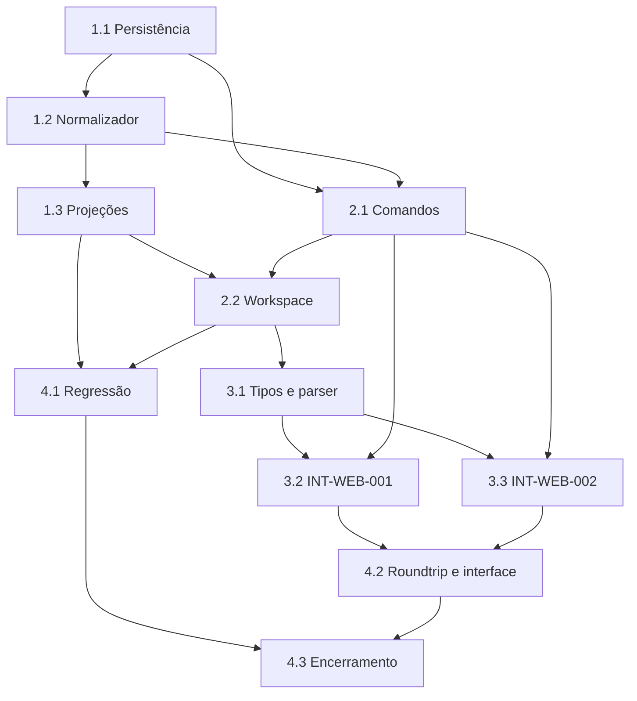

# Backlog de Implementação: Duração Planejada da Tarefa

**Escopo**: Persistir duração planejada opcional em dias úteis, normalizar início/fim/duração, projetar âncora de fim e integrar o resultado ao Gantt, dependências, status, criticidade, API e SPA.

**Legenda de status:**
- `[ ]` Pendente
- `[~]` Em andamento
- `[x]` Concluído
- `[!]` Bloqueado

**Legenda de criticidade:**
- `[C]` Crítico — impacto de segurança, concorrência ou operação bloqueante.
- `[A]` Alto — funcionalidade essencial da feature.
- `[M]` Médio — necessário, mas adiável sem bloquear o fluxo principal.

Todas as subtarefas devem produzir evidência de teste ou validação proporcional ao risco.

## FASE 1 - Persistência e núcleo determinístico

### 1.1 Duração persistida e compatibilidade legada `[A]`

Ref: Spec FR-001/FR-003/FR-012; Data Model §Tarefa e §Migração e integridade; Research Decision 1

- [x] 1.1.1 Inspecionar as migrations vigentes, decidir e registrar no modelo/contrato o nome físico da coluna antes de adicioná-la como duração opcional, sem alterar datas existentes.
- [x] 1.1.2 Aplicar nulidade, intervalo de 1 a 3650 e índice somente se a consulta projetada o justificar, mantendo validação de domínio como defesa principal.
- [x] 1.1.3 Adaptar criação e duplicação de tarefa para preservar duração explícita nula ou informada.
- [x] 1.1.4 Cobrir migration, persistência nula, limites e cópia em teste Feature com banco renovado.

### 1.2 Normalizador de planejamento `[A]`

Ref: Spec FR-002–007; Research Decision 2–3; Plan §Design e Sequência de Implementação

- [x] 1.2.1 Criar value object ou serviço puro que receba estado persistido, patch e driver `start`, `finish` ou `duration`.
- [x] 1.2.2 Implementar as normalizações início+fim, início+duração, fim+duração sem início e limpeza isolada de início/fim/duração.
- [x] 1.2.3 Rejeitar duração fora de 1 a 3650, fim anterior ao início e comando ambíguo sem driver necessário.
- [x] 1.2.4 Cobrir a matriz de combinações, calendário com fim de semana e datas civis em testes unitários determinísticos.

### 1.3 Duração resolvida e projeções de domínio `[A]`

Ref: Spec FR-006–010; Research Decision 4–5; Data Model §Valores derivados

- [x] 1.3.1 Estender `TaskProjectionInput` e `TaskPlan` para transportar duração explícita e usar uma duração resolvida compartilhada.
- [x] 1.3.2 Implementar início considerado retroativo para fim+duração sem início planejado, preservando a ausência do início persistido.
- [x] 1.3.3 Atualizar `TaskProjectionCalculator`, `SchedulingEngine` e normalizadores de seção/grupo para usar a mesma duração resolvida.
- [x] 1.3.4 Produzir estado e motivo de violação quando prazo, duração e precedência não puderem ser satisfeitos simultaneamente.
- [x] 1.3.5 Cobrir FS, SS, FF, SF, seções, caminho crítico, folga, conclusão e duração isolada nos testes unitários de scheduling.

## FASE 2 - API e workspace autoritativo

### 2.1 Comandos de criação e edição normalizados `[A]`

Ref: Spec FR-004–006/FR-012; Contracts §Criar tarefa e §Atualizar tarefa; Research Decision 2

- [x] 2.1.1 Estender validação de POST e PUT com `plannedDurationWorkdays` e `planningDriver`, preservando payloads legados válidos.
- [x] 2.1.2 Carregar o estado atual, invocar o normalizador e persistir todos os campos de planejamento normalizados em uma única transação.
- [x] 2.1.3 Retornar 422 com erro estruturado para duração inválida, intervalo inválido e intenção ambígua, sem escrita parcial.
- [x] 2.1.4 Cobrir criação, edição, limpeza, compatibilidade, autorização e todos os códigos de erro em `LocalProjectsApiTest`.

### 2.2 Leitura, indicadores e projeção do workspace `[A]`

Ref: Spec FR-008–012; Contracts §Workspace; Plan §Convenções de Borda

- [x] 2.2.1 Incluir duração explícita, duração resolvida e estado/motivo de restrição na tarefa-folha retornada pelo workspace.
- [x] 2.2.2 Conectar os valores persistidos aos dois cálculos de workspace sem permitir valores derivados enviados pelo cliente.
- [x] 2.2.3 Atualizar progresso, `without_dates`, grupos, criticidade e dependências para distinguir tarefa sem data de tarefa sem duração.
- [x] 2.2.4 Cobrir roundtrip HTTP do contrato, fim ancorado, violação e atualização de indicadores no teste Feature.

## FASE 3 - SPA e interações de planejamento

### 3.1 Tipos e parser do workspace `[A]`

Ref: Plan §Convenções de Borda; Contracts §Workspace; Interface INT-WEB-001–002

- [x] 3.1.1 Estender `Task` e o parser de workspace com paridade exata para duração explícita, resolvida e estado/motivo de restrição.
- [x] 3.1.2 Atualizar fixtures e testes da store para tarefas legadas, duração isolada, fim ancorado e violação.
- [x] 3.1.3 Criar teste smoke que compare o shape real de workspace ao contrato e aos tipos consumidos pela SPA.

### 3.2 INT-WEB-001 — Editor de duração planejada `[A]`

Ref: Interface INT-WEB-001; Spec FR-001–007/FR-011; wireframes/int-web-001.md

- [x] 3.2.1 Adicionar ao drawer o campo numérico `Duração planejada`, unidade `dias úteis`, ajuda e limites sem criar nova ação primária.
- [x] 3.2.2 Enviar driver correto ao salvar e reconciliar o workspace autorizado, sem calcular ou persistir projeções no cliente.
- [x] 3.2.3 Exibir duração resolvida e violação de planejamento no resumo calculado com texto acessível e feedback de erro preservando rascunho.
- [x] 3.2.4 Aplicar reflow da grade para desktop, tablet e telefone conforme wireframe, com drawer rolável e ações alcançáveis.
- [x] 3.2.5 Cobrir formulário padrão, teclado, leitor de tela, erro, leitor, offline e retorno de foco em testes de componente/E2E.
- [x] 3.2.6 Registrar telemetria segura de intenção, resultado, erro de validação e violação, excluindo título, ID, datas e duração.

### 3.3 INT-WEB-002 — Gestos temporais coerentes `[A]`

Ref: Interface INT-WEB-002; Spec FR-004–006/FR-008–010; Contracts §Normalização observável

- [x] 3.3.1 Atualizar movimento e resize para enviar `planningDriver` conforme gesto e para aceitar valores normalizados pelo servidor.
- [x] 3.3.2 Manter fim+duração sem início fora dos gestos de movimento/resize e orientar o uso do editor, sem impedir sua projeção no Gantt.
- [x] 3.3.3 Exibir feedback textual de limite, erro e violação sem depender exclusivamente do ghost ou de cor.
- [x] 3.3.4 Cobrir ponteiro, touch, teclado, Escape, falha remota e calendário não útil nos testes de gesto e E2E.
- [x] 3.3.5 Registrar telemetria segura do driver, modo de gesto, cancelamento e resultado, excluindo identificadores, datas e duração.

## FASE 4 - Validação integrada e documentação de entrega

### 4.1 Cenários de regressão de scheduling `[C]`

Ref: Quickstart §Scenario 1–4; Spec SC-001–004; Checklists requirements.md CHK001–012

- [x] 4.1.1 Executar e estabilizar a matriz unitária de duração, relações, grupos, status e criticidade com relógio e calendário controlados.
- [x] 4.1.2 Executar os testes Feature de persistência/API em banco renovado, incluindo autorização e nenhuma escrita parcial.
- [x] 4.1.3 Verificar que tarefas legadas preservam suas projeções anteriores quando duração explícita é nula.
- [x] 4.1.4 Registrar a evidência de violação de planejamento sem mutação silenciosa das datas planejadas.

### 4.2 Roundtrip e qualidade de interface `[A]`

Ref: Quickstart §Scenario 5; Interface INT-WEB-001–002; Checklists interface.md CHK001–012

- [x] 4.2.1 Executar o roundtrip backend–workspace–SPA contra endpoint real e confrontar o payload com `contracts/tasks-api.md`.
- [x] 4.2.2 Executar inspeção visual do wireframe em desktop, tablet e telefone e registrar diferenças corrigidas.
- [x] 4.2.3 Validar navegação por teclado, foco, mensagem de erro, unidade, contraste e alternativa aos gestos por leitor de tela.
- [x] 4.2.4 Executar typecheck, testes frontend, build e E2E, registrando falhas reais e suas correções.

### 4.3 Atualização documental e encerramento `[M]`

Ref: Spec FR-012; Plan §Project Structure; Constitution V

- [x] 4.3.1 Atualizar o modelo de dados, contrato de fronteira e documentação de planejamento com o nome físico final e campos entregues.
- [x] 4.3.2 Registrar no quickstart a evidência efetiva do roundtrip e dos cenários de regressão executados.
- [x] 4.3.3 Revisar o diff final para garantir que não há mudança de documentação ou comportamento fora do escopo da feature.

## Matriz de Dependências

## Cobertura de Interfaces

| Surface ID | Coverage | Interaction IDs | Task IDs |
|---|---|---|---|
| SURF-WEB-OPERATIONS | FULL | INT-WEB-001 | 3.2, 4.2 |
| SURF-WEB-OPERATIONS | FULL | INT-WEB-002 | 3.3, 4.2 |

## Resumo Quantitativo

| Fase | Tarefas | Subtarefas | Criticidade |
|---|---:|---:|---|
| 1 - Persistência e núcleo | 3 | 13 | A |
| 2 - API e workspace | 2 | 8 | A |
| 3 - SPA e interações | 3 | 14 | A |
| 4 - Validação e entrega | 3 | 11 | C, A, M |
| **Total** | **11** | **46** | — |

## Escopo Coberto

| Item | Descrição | Fase |
|---|---|---|
| DUR-001 | Persistência opcional e compatibilidade legada | 1 |
| DUR-002 | Normalização e projeções de dependência/criticidade | 1–2 |
| DUR-003 | Contratos, workspace e indicadores | 2–3 |
| DUR-004 | Editor e gestos acessíveis/responsivos | 3 |
| DUR-005 | Regressão, roundtrip e documentação final | 4 |

## Escopo Excluído

| Item | Descrição | Motivo |
|---|---|---|
| EXC-001 | Lag/lead, esforço em horas e alocação de recursos | Não fazem parte da duração inteira em dias úteis aprovada. |
| EXC-002 | Reagendamento automático que persista datas por causa de duração | A feature preserva intenção planejada; automação exige escopo próprio. |
| EXC-003 | Nova categoria de status para violação | A violação é um estado complementar, sem alterar os status canônicos. |
| EXC-004 | Mudança em integrações externas | A feature atua exclusivamente no domínio local de projetos. |
