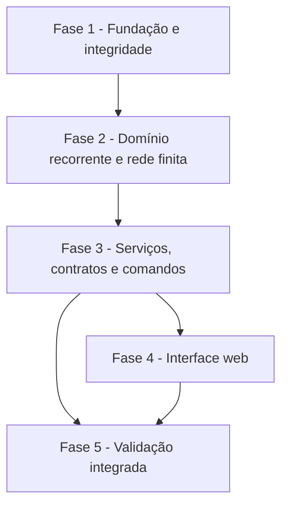

# Tarefas Ganttist - Recorrência e Soneca

Escopo: Implementar tarefas recorrentes com ocorrência lógica, soneca em dias úteis, preview de impacto, histórico idempotente e indicadores finitos preservados no projeto local.

**Legenda de status:**

- `[ ]` Pendente
- `[~]` Em andamento
- `[x]` Concluído
- `[!]` Bloqueado

**Legenda de criticidade:**

- `[C]` Crítico - Impacto financeiro direto, regulatório, segurança, SLA ou operação bloqueante
- `[A]` Alto - Funcionalidade essencial
- `[M]` Médio - Necessário, mas sem urgência imediata

---

## FASE 1 - Fundação e integridade de dados

### 1.1 Definir retenção do histórico de ocorrência `[x]`

Ref: `checklists/requirements.md` CHK025; `data-model.md` §Integridade e migração

- [x] 1.1.1 Obter do dono do produto a decisão de retenção/anonimização ou exclusão em cascata ao excluir tarefa e projeto. Decisão aprovada em 2026-09-24: exclusão em cascata na V1.
- [x] 1.1.2 Registrar a decisão no briefing, spec, modelo de dados e checklist, substituindo a pendência humana.
- [x] 1.1.3 Ajustar a política de exclusão proposta para FKs e consultas de histórico conforme a decisão aprovada.
- [x] 1.1.4 Revisar a decisão contra privacidade, autorização por projeto e ausência de exposição de dados apagados.

### 1.2 Criar persistência aditiva de recorrência e ocorrências `[x]`

Ref: `data-model.md` §Tarefa recorrente–§Integridade e migração; Spec FR-001–002, FR-010–011

- [x] 1.2.1 Criar migration aditiva para `recurrenceRule`, `recurrenceCursor` e `recurrenceVersion` sem preencher tarefas existentes.
- [x] 1.2.2 Criar a tabela de histórico, FKs, checks, índices de consulta e unicidades de data lógica/chave de comando aprovados.
- [x] 1.2.3 Garantir que schema novo e projeto existente preservem tarefas não recorrentes e duplicação de projeto/tarefa atual.
- [x] 1.2.4 Escrever teste de integração de migration e integridade para regra/cursor, histórico, unicidade e exclusão conforme a decisão 1.1.

## FASE 2 - Domínio recorrente e rede finita

### 2.1 Implementar regra estruturada e gramática PT-BR V1 `[x]`

Ref: `research.md` §Decision 1 e §Decision 5; Spec FR-003–006

- [x] 2.1.1 Criar value objects imutáveis para regra, padrão, base, limites e representação de ocorrência lógica.
- [x] 2.1.2 Implementar parser PT-BR para frequência, listas, ordinais, dia útil, início, término, intervalos em dias úteis e intervalos de calendário em semanas, meses e anos, incluindo aliases aprovados.
- [x] 2.1.3 Implementar formatter canônico e validações que façam editor visual e expressão produzir a mesma regra.
- [x] 2.1.4 Escrever testes unitários de parsing, formatação, erros localizados e equivalência de entradas.

### 2.2 Implementar cálculo e transições de ocorrência `[x]`

Ref: `research.md` §Decision 2–3; Spec FR-007–013

- [x] 2.2.1 Calcular próxima data fixa estritamente posterior ao maior entre agendamento e conclusão.
- [x] 2.2.2 Calcular próxima data de intervalo com `max(cursor, agendamento, conclusão)`: dias em dias úteis; semanas, meses e anos em calendário, aplicando fim de mês, 29 de fevereiro e normalização posterior do agendamento.
- [x] 2.2.3 Implementar término inclusivo, pulo de perdidas, remoção de regra e encerramento definitivo.
- [x] 2.2.4 Cobrir antecipação, atraso, feriado, duração multi-dia, término e ausência de próxima ocorrência com testes de domínio.

### 2.3 Separar projeção operacional da rede finita `[x]`

Ref: `research.md` §Decision 4; Spec FR-020–023; Plan §Design e Sequência de Implementação

- [x] 2.3.1 Estender entradas de projeção/scheduling com participação explícita na rede finita.
- [x] 2.3.2 Manter recorrente como sucessora projetável e excluí-la de término, folga e caminho crítico finitos.
- [x] 2.3.3 Adaptar resumo/progresso para separar métricas finitas de contagens operacionais de ocorrência.
- [x] 2.3.4 Escrever testes de unidade para bloqueio como sucessora, CPM/progresso finitos e combinações com tarefas não recorrentes.
- [x] 2.3.5 Substituir no resumo qualquer consulta legada a `project_task_dependencies` pela fonte autoritativa `project_schedule_dependencies`, aplicando `SectionDependencyNormalizer` antes das métricas finitas.

## FASE 3 - Serviços, contratos e comandos seguros

### 3.1 Centralizar projeção reutilizável de workspace e impacto `[x]`

Ref: `plan.md` §Project Structure e §Design e Sequência de Implementação; Spec FR-018–019

- [x] 3.1.1 Extrair do controller a montagem autorizada de workspace para serviço de projeção compartilhado.
- [x] 3.1.2 Permitir projeção efêmera de planejamento normalizado sem persistir a tarefa.
- [x] 3.1.3 Comparar projeções antes/depois e classificar impacto informativo, alerta e crítico conforme contrato.
- [x] 3.1.4 Escrever testes de serviço para cascata, término finito, criticidade, violação e cancelamento sem escrita.

### 3.2 Implementar ciclo de vida da regra e validação de dependências `[x]`

Ref: `contracts/recurrence-api.md` §Interpretar ou salvar recorrência; Spec FR-003–006, FR-012–013, FR-021

- [x] 3.2.1 Expor interpretação de expressão e criação/edição/remoção/encerramento de regra com autorização de projeto.
- [x] 3.2.2 Usar versão esperada para detectar edição concorrente e devolver erros consistentes ao cliente.
- [x] 3.2.3 Validar predecessora recorrente em criação/edição de dependência, alteração de seção e mudança de recorrência.
- [x] 3.2.4 Escrever testes de API para permissões, gramática, versão obsoleta, término, remoção e dependência por seção.

### 3.3 Implementar preview e confirmação de soneca `[x]`

Ref: `contracts/recurrence-api.md` §Preview e confirmação de soneca; Spec FR-014–019

- [x] 3.3.1 Resolver opções rápidas e data manual pelo calendário, preservando duração via normalizador de planejamento.
- [x] 3.3.2 Publicar preview com alvo normalizado, comparação, severidades, token e revisão de workspace.
- [x] 3.3.3 Revalidar preview/cursor na confirmação e aplicar apenas planejamento da ocorrência corrente em transação.
- [x] 3.3.4 Escrever testes de API para dia não útil, 3/7 dias úteis, cancelamento, impacto crítico e preview obsoleto.

### 3.4 Implementar conclusão idempotente e consulta de histórico `[x]`

Ref: `contracts/recurrence-api.md` §Concluir ocorrência e consultar histórico; Spec FR-009–012

- [x] 3.4.1 Serializar conclusão com cursor esperado, chave de comando e bloqueio transacional da tarefa.
- [x] 3.4.2 Gravar snapshot de histórico uma única vez e avançar/encerrar a série na mesma transação.
- [x] 3.4.3 Expor paginação de histórico com dados autorizados e sem vazar ocorrência de outro projeto.
- [x] 3.4.4 Escrever testes de API para retry idempotente, conflito de cursor, histórico paginado, autor e conclusão definitiva.

### 3.5 Estender contrato de workspace e paridade de tipos `[x]`

Ref: `contracts/recurrence-api.md` §Workspace; Plan §Convenções de Borda

- [x] 3.5.1 Acrescentar regra, ocorrência, histórico contado, participação finita e os blocos `stats.finite`/`stats.operational` documentados à resposta autoritativa do workspace.
- [x] 3.5.2 Atualizar parser de contrato e tipos compartilhados do cliente para todos os campos, enums e nulidades novos.
- [x] 3.5.3 Garantir que erro de contrato conserve a última projeção válida e não invente valores de recorrência localmente.
- [x] 3.5.4 Criar teste de contrato/roundtrip que compare payload real, tipos consumidos e shape documentado.

## FASE 4 - Interface web responsiva

### 4.1 Implementar INT-WEB-001 — editor de recorrência `[A]`

Ref: `interface-spec.md` §INT-WEB-001; Spec FR-003–006, FR-012–013, FR-024–025, FR-027

- [ ] 4.1.1 Adicionar seção Recorrência ao painel com expressão, editor visual, resumo canônico e prévia de ocorrência.
- [ ] 4.1.2 Integrar interpretação, salvar, remover e concluir definitivamente com rascunho, versão e feedback definidos.
- [ ] 4.1.3 Aplicar `v-default-form`, `DefaultSubmitButton`, estados de erro/stale/offline e adaptação desktop–telefone.
- [ ] 4.1.4 Criar testes de componente e E2E para expressão, editor visual, permissões, teclado, toque e confirmações.

### 4.2 Implementar INT-WEB-002 — soneca e preview `[A]`

Ref: `interface-spec.md` §INT-WEB-002; Spec FR-014–019, FR-024–025

- [ ] 4.2.1 Inserir ação Adiar ocorrência nos pontos de entrada existentes e opções rápidas/data escolhida.
- [ ] 4.2.2 Renderizar preview antes/depois, data normalizada, severidade e confirmação/cancelamento.
- [ ] 4.2.3 Cobrir foco, teclado, toque, responsividade da folha móvel, erro remoto e preview obsoleto.
- [ ] 4.2.4 Criar testes de componente e E2E para atalho, impacto crítico, cancelamento e conflito concorrente.

### 4.3 Implementar INT-WEB-003 — conclusão e histórico `[A]`

Ref: `interface-spec.md` §INT-WEB-003; Spec FR-009–012, FR-024–025, FR-027

- [ ] 4.3.1 Adaptar o controle existente para Concluir ocorrência e confirmação com data efetiva/resultado previsto.
- [ ] 4.3.2 Adicionar histórico paginado, estados vazios, carregamento, erro e leitura por leitor.
- [ ] 4.3.3 Inserir conclusão definitiva separada, feedback idempotente/conflito e acessibilidade de diálogo/lista.
- [ ] 4.3.4 Criar testes de componente e E2E para conclusão, retry, histórico, permissão e layout móvel.

### 4.4 Implementar INT-WEB-004 — representação em Gantt e Tarefas `[A]`

Ref: `interface-spec.md` §INT-WEB-004; Spec FR-020–025

- [ ] 4.4.1 Exibir marcador semântico, regra curta, data lógica e soneca na linha/cartão e barra corrente.
- [ ] 4.4.2 Diferenciar estado operacional de indicadores finitos sem alterar filtros, árvore, timeline ou geometria existente.
- [ ] 4.4.3 Implementar tooltip/foco/toque, placeholders de snapshot e comportamento stale/offline definido.
- [ ] 4.4.4 Criar testes visuais/de componente para Gantt e Tarefas, leitor, zoom e responsividade.

## FASE 5 - Validação integrada e qualidade de entrega

### 5.1 Executar cenários integrados e regressão de planejamento `[A]`

Ref: `quickstart.md` §Scenario 1–6; Spec SC-001–006

- [ ] 5.1.1 Implementar cenários end-to-end de regra fixa, intervalo, soneca, conclusão e histórico com dados reais.
- [ ] 5.1.2 Cobrir regressão de calendário, duração, dependências FS/SS/FF/SF, projeção e caminho crítico finito.
- [ ] 5.1.3 Verificar roundtrip de API, workspace e cliente sem fixture para os comandos críticos.
- [x] 5.1.4 Executar e registrar PHPUnit, Vitest, `vue-tsc`, build e Playwright conforme a suíte do projeto. Evidência 2026-09-25: PHPUnit 150/808; Vitest 24/88; vue-tsc e build aprovados; Playwright 25/25.

### 5.2 Validar acessibilidade, autorização e privacidade `[A]`

Ref: Constitution IV–V; Interface §Cross-Surface Rules; Spec FR-024–025

- [ ] 5.2.1 Verificar os fluxos críticos por teclado, toque, leitor de tela, foco, contraste e zoom nos form factors declarados.
- [ ] 5.2.2 Verificar proprietário/editor/leitor, isolamento por projeto e respostas de acesso removido em todos os novos comandos.
- [ ] 5.2.3 Revisar telemetria, mensagens e logs para não incluir regra, título, datas, IDs ou histórico de ocorrência.
- [ ] 5.2.4 Registrar evidência de validação de acessibilidade, autorização e privacidade proporcional ao risco.

### 5.3 Medir desempenho e concluir quickstart `[M]`

Ref: Spec SC-007; Plan §Technical Context e §Validation Scenarios

- [ ] 5.3.1 Preparar projeto representativo com até 2.000 tarefas, recorrentes e cadeia de dependências.
- [ ] 5.3.2 Medir preview de soneca e verificar meta p95 de até um segundo em condições documentadas.
- [ ] 5.3.3 Investigar e registrar qualquer regressão de carregamento, memória ou virtualização do workspace.
- [ ] 5.3.4 Executar todos os cenários do quickstart e anexar evidências de aprovação ou tarefas emergentes.

## Matriz de Dependências

## Cobertura de Interfaces

| Surface ID | Coverage | Interaction IDs | Task IDs |
|------------|----------|-----------------|----------|
| SURF-WEB-OPERATIONS | FULL | INT-WEB-001 | 4.1 |
| SURF-WEB-OPERATIONS | FULL | INT-WEB-002 | 4.2 |
| SURF-WEB-OPERATIONS | FULL | INT-WEB-003 | 4.3 |
| SURF-WEB-OPERATIONS | FULL | INT-WEB-004 | 4.4 |

## Resumo Quantitativo

| Fase | Tarefas | Subtarefas | Criticidade |
|------|---------|------------|-------------|
| 1 - Fundação e integridade | 2 | 8 | A |
| 2 - Domínio recorrente e rede finita | 3 | 13 | A |
| 3 - Serviços, contratos e comandos | 5 | 20 | A |
| 4 - Interface web responsiva | 4 | 16 | A |
| 5 - Validação integrada e qualidade | 3 | 12 | A, M |
| **Total** | **17** | **69** | — |

## Escopo Coberto

| Item | Descrição | Fase |
|------|-----------|------|
| REC-DOM | Regra, parser PT-BR, cursor, avanço e histórico | 1–3 |
| REC-PLAN | Calendário, soneca, preview, dependências e rede finita | 2–3 |
| REC-API | Contratos, autorização, conflito e idempotência | 3 |
| INT-WEB | Editor, soneca, conclusão/histórico e Gantt/Tarefas | 4 |
| QUALITY | Regressão, E2E, acessibilidade, privacidade e desempenho | 5 |

## Escopo Excluído

| Item | Descrição | Motivo |
|------|-----------|--------|
| REC-CATCHUP | Concluir em fila ocorrências perdidas | A V1 fixa `skip missed occurrences`. |
| REC-DEPENDENCY | Dependências entre ocorrências ou recorrente como predecessora | Exige semântica de correspondência por ocorrência fora desta entrega. |
| REC-NLP | Linguagem natural além da gramática PT-BR publicada | Preservar cálculo determinístico e diagnósticos claros. |
| REC-HOURS | Recorrência ou soneca por hora | Projeto planeja somente dias civis e úteis. |
| REC-REPORTS | Relatórios analíticos avançados de aderência | Pós-MVP; histórico básico entra nesta entrega. |
