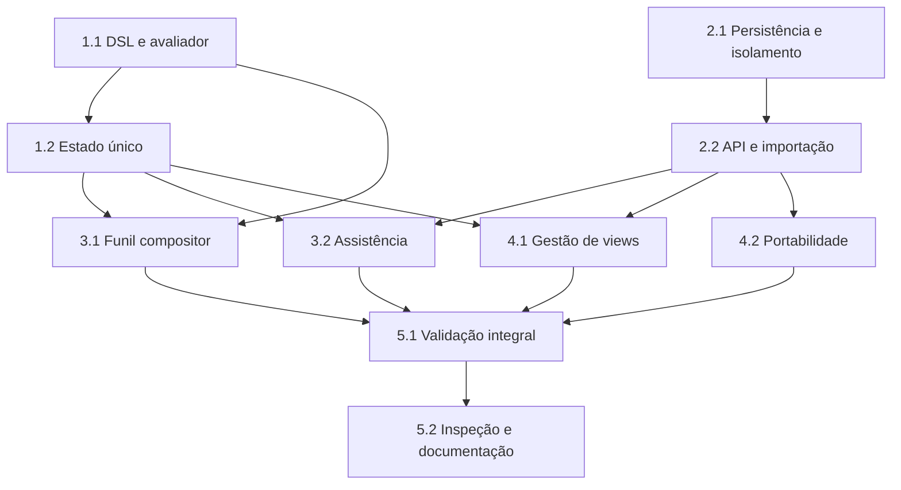

# Backlog de Implementação: Busca Unificada e Views de Tarefas

**Escopo**: Unificar busca e filtros em uma DSL, persistir views privadas por usuário/projeto e entregar assistência, importação/exportação e restauração visual entre Tarefas e Gantt.

**Legenda de status:**

- `[ ]` Pendente
- `[~]` Em andamento
- `[x]` Concluído
- `[!]` Bloqueado

**Legenda de criticidade:**

- `[C]` Crítico — impacto de segurança, isolamento de dados ou operação bloqueante.
- `[A]` Alto — funcionalidade essencial da feature.
- `[M]` Médio — necessário, mas adiável sem bloquear o fluxo principal.

Todas as subtarefas devem produzir evidência de teste ou validação. Não há gaps abertos nos checklists a converter em trabalho adicional.

## FASE 1 - Fundação da consulta unificada

### 1.1 DSL, AST e diagnóstico compatíveis `[A]`

Ref: Spec FR-001–FR-011; Plan §Architecture and Delivery Approach/§DSL Canonical; research.md Decision 2

- [x] 1.1.1 Estender o parser atual para distinguir termo livre e predicado `campo:valor`, preservando `&`, `|`, `!`, parênteses, curinga e escape.
- [x] 1.1.2 Definir aliases, valores canônicos e quoting para status, responsável, data, prioridade e seção, incluindo posições de erro precisas.
- [x] 1.1.3 Criar avaliador determinístico para dados de tarefa projetados, incluindo `eu`, `sem`, `outros`, datas relativas e valores textuais desconhecidos.
- [x] 1.1.4 Cobrir parser, precedência, compatibilidade regressiva, datas e diagnósticos com testes unitários.

### 1.2 Estado de query e projeção filtrada `[A]`

Ref: Spec FR-002/FR-010–FR-016; Plan §Architecture and Delivery Approach; quickstart.md Scenarios 1–2

- [x] 1.2.1 Consolidar query bruta, última query válida, análise, advertências e contagem no estado de workspace.
- [x] 1.2.2 Substituir filtros paralelos de status, responsável e período pela avaliação da mesma expressão sobre a projeção autorizada.
- [x] 1.2.3 Preservar foco de relações, exceções de filtro, grupos ancestrais e comportamento de limpeza no novo estado único.
- [x] 1.2.4 Criar testes do store para erro preservando resultado, igualdade entre Tarefas/Gantt e regressão de filtros atuais.

## FASE 2 - Persistência, autorização e contratos de views

### 2.1 Modelo persistente e isolamento de views `[C]`

Ref: Spec FR-017–FR-027; data-model.md §View/§Consulta Recente; checklists/security.md CHK001–CHK004

- [x] 2.1.1 Criar migration para views e histórico de query com proprietário, projeto, nome, query, estado visual, versão, índices e unicidade necessários.
- [x] 2.1.2 Implementar a provisão idempotente de Minhas Tarefas e Tarefas Equipe na primeira listagem do usuário no projeto.
- [x] 2.1.3 Definir serialização/versionamento do estado visual e do arquivo exportável sem IDs, tarefas, pessoas, membros ou permissões de origem.
- [x] 2.1.4 Implementar acesso deny-by-default para coleção de views e histórico por usuário/projeto, reutilizando acesso de consulta do projeto.
- [x] 2.1.5 Cobrir schema, unicidade, provisão sob demanda, cascata, isolamento e minimização da exportação em testes Feature.

### 2.2 API de views, histórico e importação `[A]`

Ref: contracts/views-api.md; Spec FR-020–FR-027; Plan §Convenções de Borda

- [x] 2.2.1 Expor contratos de listar, criar, atualizar e excluir views com DTO camelCase e erros coerentes.
- [x] 2.2.2 Manter consultas efêmeras: não persistir nem expor histórico de buscas por usuário/projeto.
- [x] 2.2.3 Implementar importação versionada, validação estrutural, conflito `create/overwrite/cancel` e advertências para referências desconhecidas.
- [x] 2.2.4 Criar testes de integração para autorização, 404/403/409/422, importação tolerante e paridade de payload com contrato.

## FASE 3 - Integração da barra de comandos

### 3.1 Funil como compositor da expressão `[A]`

Ref: Interface INT-WEB-001; Spec FR-012–FR-015; wireframes/int-web-001.md

- [x] 3.1.1 Remover o estado independente do popover e fazer cada seleção do funil compor ou substituir somente o critério correspondente na query.
- [x] 3.1.2 Exibir critérios derivados, resumo legível, contagem e estado vazio sem ocultar a expressão original.
- [x] 3.1.3 Manter botão de limpar, atalho `/`, Esc, foco e os controles de Gantt sem conflito com a nova query.
- [x] 3.1.4 Cobrir composição booleana, limpeza, estado vazio e regressão do funil existente com testes de componente/store.

### 3.2 Autocomplete, ajuda e histórico assistidos `[A]`

Ref: Interface INT-WEB-001; Spec FR-013–FR-016/FR-028; quickstart.md Scenarios 1–2/6

- [x] 3.2.1 Implementar sugestões contextuais de campos, operadores, valores especiais, responsáveis e seções, com inserção segura de valores com espaço.
- [x] 3.2.2 Implementar ajuda com referência de sintaxe e exemplos inseríveis, incluindo escape, aspas e datas relativas.
- [x] 3.2.3 Integrar histórico remoto de consultas válidas, comportamento offline e advertência não bloqueante de referência desconhecida.
- [x] 3.2.4 Cobrir teclado, toque, composição de texto, leitor de tela, mensagens de status e respostas reais de histórico. Evidência: E2E cobre `/`, `isComposing`, controles por toque, rótulo acessível, diálogos e mensagem `role=status`; Feature e contrato cobrem a resposta autorizada e a forma do histórico.

## FASE 4 - Views e portabilidade na interface

### 4.1 Aplicação e gestão de views `[A]`

Ref: Interface INT-WEB-002; Spec FR-017–FR-023; wireframes/int-web-002.md

- [x] 4.1.1 Criar seletor de views privadas com as views iniciais editáveis Minhas Tarefas e Tarefas Equipe.
- [x] 4.1.2 Capturar e restaurar query, agrupamento, subagrupamento, ordenação, subordenação, colunas, hierarquia e estado específico de Tarefas/Gantt.
- [x] 4.1.3 Implementar criar, renomear, duplicar, excluir, salvar como nova e sobrescrever com confirmação, sem autosave nem aviso de alterações não salvas.
- [x] 4.1.4 Cobrir permissões de leitor, restauração cruzada de modos, confirmações, erros remotos, desktop/tablet/telefone e acessibilidade. Evidência: Feature prova isolamento/propriedade e acesso de leitor; E2E prova restauração Tarefas→Gantt, confirmação, falha offline, breakpoints e nomes/roles acessíveis.

### 4.2 Exportação, importação e resolução de conflito `[A]`

Ref: Interface INT-WEB-003; Spec FR-024–FR-028; wireframes/int-web-003.md

- [x] 4.2.1 Implementar exportação de view selecionada usando o formato versionado e portável definido no contrato.
- [x] 4.2.2 Implementar seleção/validação de arquivo, resumo seguro e advertências de referências ausentes antes da escrita.
- [x] 4.2.3 Implementar diálogo de colisão com copiar, sobrescrever e cancelar, preservando configuração e arquivo em caso de falha.
- [x] 4.2.4 Cobrir importação/exportação real, conflito, cancelamento, arquivo inválido, offline, teclado, toque e anúncios acessíveis. Evidência: E2E cobre download, cópia, cancelamento, sobrescrita confirmada, JSON inválido, `role=alert`, teclado, toque e mutação bloqueada offline; Feature cobre o roundtrip real da API.

## FASE 5 - Validação integral e entrega

### 5.1 Contratos, roundtrip e regressão `[C]`

Ref: quickstart.md Scenarios 1–6; Spec SC-001–SC-007; checklists/api.md; checklists/performance.md

- [x] 5.1.1 Executar roundtrip real de views e histórico, comparando payloads com contrato e parser da SPA sem mocks. Evidência: `ProjectTaskViewsApiTest` exercita listagem, criação, atualização, importação e histórico contra a API Laravel; `task-views-contract.test.ts` valida as mesmas formas de resposta antes do consumo na SPA.
- [x] 5.1.2 Executar suítes PHP, Vitest, verificação de tipos, build e E2E, corrigindo regressões da busca, filtros, Gantt e permissões.
- [x] 5.1.3 Medir o cenário nominal de 2.000 tarefas contra o critério de atualização de query e registrar resultado.
- [x] 5.1.4 Verificar que telemetria, mensagens e exportações não expõem query integral, títulos, nomes, IDs ou dados de origem indevidos.

### 5.2 Inspeção de interface e documentação de uso `[M]`

Ref: Interface INT-WEB-001–003; checklists/interface.md; checklists/security.md CHK005

- [x] 5.2.1 Inspecionar os wireframes em desktop, tablet e telefone e registrar ajustes necessários de reflow, foco, contraste e alvos touch. Evidência: a barra de comandos preserva os controles em 390/768/1440px sem overflow próprio; controles têm alvo mínimo de 38px e semântica acessível.
- [x] 5.2.2 Validar todos os estados canônicos da interface, inclusive vazio, validação, remoto, offline, acesso negado e stale. Evidência: testes da store cobrem validação, vazio e stale; E2E cobre offline; Feature cobre 404/409/422 e isolamento de acesso.
- [x] 5.2.3 Documentar sintaxe canônica, exemplos, limitações de importação e comportamento de views privadas para o usuário final.
- [x] 5.2.4 Revisar backlog, marcar evidências concluídas e registrar trabalho emergente antes da entrega. Auditoria concluída em 2026-09-22: as 41 subtarefas possuem implementação e evidência; o único acompanhamento não bloqueante são avisos preexistentes do bundler sobre diretivas de dependências e chunks grandes.

## Matriz de Dependências

## Cobertura de Interfaces

| Surface ID | Coverage | Interaction IDs | Task IDs |
|---|---|---|---|
| SURF-WEB-OPERATIONS | FULL | INT-WEB-001 | 3.1, 3.2, 5.1, 5.2 |
| SURF-WEB-OPERATIONS | FULL | INT-WEB-002 | 4.1, 5.1, 5.2 |
| SURF-WEB-OPERATIONS | FULL | INT-WEB-003 | 4.2, 5.1, 5.2 |

## Resumo Quantitativo

| Fase | Tarefas | Subtarefas | Criticidade |
|---|---:|---:|---|
| 1 - Fundação da consulta | 2 | 8 | A |
| 2 - Persistência e contratos | 2 | 9 | C, A |
| 3 - Barra de comandos | 2 | 8 | A |
| 4 - Views e portabilidade | 2 | 8 | A |
| 5 - Validação e entrega | 2 | 8 | C, M |
| **Total** | **10** | **41** | - |

## Escopo Coberto

| Item | Descrição | Fase |
|---|---|---|
| DSL | Busca textual e filtros com operadores, predicados, datas e responsáveis | 1 |
| Persistência | Views e histórico isolados por usuário e projeto | 2 |
| INT-WEB-001 | Campo, funil, autocomplete, ajuda, histórico e feedback | 3 |
| INT-WEB-002 | Aplicação e gestão de views completas | 4 |
| INT-WEB-003 | Exportação, importação e colisões | 4 |
| Qualidade | Contrato, E2E, acessibilidade, segurança e desempenho | 5 |

## Escopo Excluído

| Item | Descrição | Motivo |
|---|---|---|
| Views compartilhadas | Colaboração, edição compartilhada ou links públicos | Fora do escopo aprovado; views são privadas |
| Critérios de dependência e caminho crítico | Novos predicados de consulta | Pós-MVP definido na spec |
| Assistente por linguagem natural | Conversão de intenção livre em query | Pós-MVP; requer linguagem determinística consolidada |
| Autosave de view | Persistência implícita de alterações temporárias | Contraria decisão explícita do produto |
