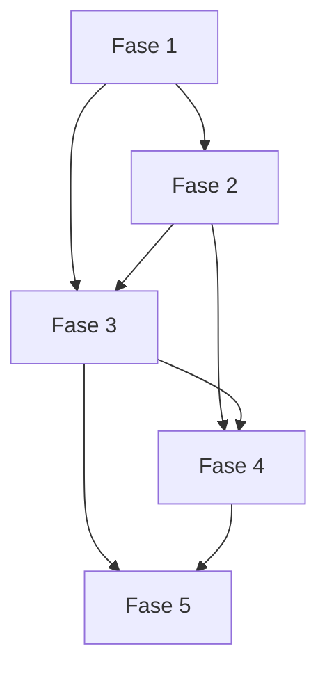

# Tarefas Ganttist - MVP alinhado à especificação v1.0

Escopo: corrigir, substituir e completar o vertical slice existente até cobrir as oito specs aprovadas, sem incluir funcionalidades fora do MVP.

**Legenda de status:** `[ ]` Pendente · `[~]` Em andamento · `[x]` Concluído · `[!]` Bloqueado
**Criticidade:** `[C]` segurança/operação bloqueante · `[A]` funcionalidade essencial · `[M]` necessária sem bloqueio imediato.

## FASE 1 - Decisões e fundações

### 1.1 Fechar parâmetros operacionais configuráveis `[C]`

Ref: `docs/checklists/mvp-quality-gate.md` CHK014–015, CHK018

- [x] 1.1.1 Registrar responsáveis, ambiente e valores aprovados de SLO/RPO/RTO ou marcar configuração pendente de deployment. <!-- docs/operations-baseline.md -->
- [x] 1.1.2 Definir política de compliance/retenção e mapeá-la a auditoria, exclusão de conta e backups. <!-- docs/operations-baseline.md -->
- [x] 1.1.3 Definir metas de performance percebida e capacidade para o gate 2k/5k. <!-- docs/operations-baseline.md -->

### 1.2 Consolidar contratos e modelo autorizado `[A]`

Ref: Constituição I–III; auditoria §Achados transversais

- [x] 1.2.1 Criar contratos versionados de workspace, comandos, operação e eventos. <!-- docs/contracts/planning-boundary.md -->
- [x] 1.2.2 Criar schemas/mapper de boundary e testes de paridade API–SPA. <!-- `WorkspaceController::fromTodoist` mapeia a borda; `workspace-contract.ts` valida a resposta antes do store e Vitest cobre preservação da projeção em contrato inválido -->
- [x] 1.2.3 Documentar modelo de dados final e migrations de transição sem perda de metadados. <!-- docs/data-model.md -->

## FASE 2 - Domínio determinístico e grafo

### 2.1 Completar calendário, tarefas e grupos `[A]`

Ref: `calendar-task-dates/spec.md` FR-001–008; INT-CALENDAR-001/002

- [x] 2.1.1 Carregar calendário/configurações reais por Gantt no core. <!-- ProjectCalendarService usado por simulação e aplicação -->
- [x] 2.1.2 Corrigir semântica de tarefa sem data, data virtual, conclusão e deadline não útil. <!-- core e projeção cobertos por testes -->
- [x] 2.1.3 Implementar derivação bottom-up de grupos e golden tests de calendário/grupos. <!-- GroupScheduleCalculator + testes unitários e integração de snapshot -->

### 2.2 Completar precedência e criticidade `[A]`

Ref: `dependencies-critical-path/spec.md` FR-001–008; INT-DEPS-001/002

- [x] 2.2.1 Centralizar validação de escopo, grupo predecessor, duplicidade e ciclo. <!-- DependencyScopeValidator + testes de API -->
- [x] 2.2.2 Implementar forward/backward pass completo, folga e criticidade para FS/SS/FF/SF. <!-- golden tests FS/SS/FF/SF, folga paralela e conclusão efetiva -->
- [x] 2.2.3 Criar golden tests para múltiplas predecessoras, grupos, conclusão e filtros ocultos. <!-- golden tests do core + relação oculta revelável no store -->

## FASE 3 - Operações, persistência e Todoist

### 3.1 Modelar operação lógica e cascata recuperável `[C]`

Ref: `rescheduling-operations/spec.md` FR-001–008; INT-OPS-001/002

- [x] 3.1.1 Persistir comando, snapshot, itens, estados, idempotência e cadeia causal. <!-- snapshots por item, sequência, commandId e audit_events causal -->
- [x] 3.1.2 Implementar simulação/revalidação/batches sem transação local aguardando Todoist. <!-- intenção autorizada, revalidação de snapshot e execução sequencial por camada -->
- [x] 3.1.3 Implementar retries, falha parcial, reconciliação e testes de operação composta. <!-- ProcessRecalculation, backoff e testes de interrupção/retomada -->

### 3.2 Completar adapter e reconciliação Todoist `[C]`

Ref: `todoist-synchronization/spec.md` FR-001–008; INT-SYNC-001/002

- [x] 3.2.1 Expandir contract tests do adapter e tratamento de token revogado/rate limit. <!-- contract de escrita autenticada; 401/403 exige reautorização e 429 preserva evento pendente/degradado -->
- [x] 3.2.2 Processar webhook/eventos idempotentes em fila e reconciliar snapshots incrementais. <!-- HMAC, deduplicação antes da fila, escopo por projeto e reconciliação restaurável -->
- [x] 3.2.3 Publicar eventos de workspace, detectar conflito e testar múltiplos clientes/ordem/eco. <!-- feed autorizado e ordenado por audit event, causationId e operação em conflito -->

### 3.3 Completar acesso e isolamento `[C]`

Ref: `access-todoist/spec.md` FR-001–008; INT-ACCESS-001–003

- [x] 3.3.1 Implementar gestão/revogação de sessões e exclusão de conta. <!-- API isolada e painel acessível da conta -->
- [x] 3.3.2 Implementar rotação de chaves/tokens e hardening de OAuth/webhook. <!-- OAuth state atômico, rotação registrada, HMAC e validação de payload -->
- [x] 3.3.3 Criar testes de isolamento, enumeração, expiração e homologação externa controlada. <!-- suites passwordless, OAuth HTTP fake e webhooks -->

## FASE 4 - Projeção e interfaces

### 4.1 Entregar projeção autorizada do workspace `[A]`

Ref: `gantt-workspace/spec.md` FR-001–007; INT-WORKSPACE-001

- [x] 4.1.1 Substituir projeção simplificada por árvore, grupos, estados e calendário calculados. <!-- contrato enriquecido por snapshot real/calendário/engine -->
- [x] 4.1.2 Integrar DTO autorizado no store e estados loading/vazio/stale/erro. <!-- store e SPA preservam leitura anterior em falha -->
- [x] 4.1.3 Criar integração/E2E de seleção, hierarquia e atualização sem reload. <!-- `App.test.ts` cobre seleção de projeto, hierarquia e reconciliação sem remontar a SPA -->

### 4.2 Executar spike e renderer Gantt acessível `[A]`

Ref: `gantt-navigation-experience/spec.md` FR-001–008; INT-NAV-001/002

- [x] 4.2.1 Implementar virtualização vertical/horizontal e janela temporal sem intervalo fixo. <!-- janela vertical/horizontal limitada por viewport; intervalo deriva das tarefas -->
- [x] 4.2.2 Implementar busca, filtros, relações ocultas, teclado, touch e responsividade. <!-- busca/filtros, dependências ocultas reveláveis, árvore por teclado, Pointer Events e breakpoints -->
- [~] 4.2.3 Medir 2k/5k, testar dispositivos reais e registrar gate do spike. <!-- benchmark Chromium headless no staging: 2k/5k com 32 nós no DOM; matriz de dispositivos físicos permanece pendente; evidência em docs/performance-evidence.md -->

### 4.3 Implementar fluxos de calendário, dependência e operação `[A]`

Ref: INT-CALENDAR-001/002, INT-DEPS-001/002, INT-OPS-001/002

- [x] 4.3.1 Implementar telas/painéis e estados canônicos de calendário/datas. <!-- painel versionado, prévia/confirmacão manual, automático e aviso de calendário -->
- [x] 4.3.2 Implementar criação/inspeção acessível de dependências e criticidade. <!-- painel textual, confirmação explícita, validação de ciclo/escopo e indicação de criticidade -->
- [x] 4.3.3 Implementar ghosts, confirmação, recuperação e rota com testes de componente/E2E. <!-- `App.test.ts` cobre ghost, confirmação explícita, operação concluída e reconciliação; testes de API cobrem retry/conflito -->

### 4.4 Implementar estados de sincronização e histórico `[A]`

Ref: INT-SYNC-001/002; INT-AUDIT-001

- [x] 4.4.1 Implementar badges, conflitos e recuperação sincronizados por eventos reais. <!-- SSE retomável, diagnóstico de pendências/conflitos e reconexão/reconciliação -->
- [x] 4.4.2 Implementar writer de auditoria, consulta paginada e cadeia causal. <!-- AuditWriter, API filtrável por cursor e causationId -->
- [x] 4.4.3 Implementar painel de histórico acessível e testes de isolamento/paginação. <!-- painel sob demanda e teste de owner/cursor/filtro -->

## FASE 5 - Qualidade, operação e release

### 5.1 Fechar matriz de testes e observabilidade `[C]`

Ref: Constituição IV; especificação §18N/18O

- [~] 5.1.1 Expandir suites golden, integração MySQL, contract Todoist, E2E e carga. <!-- PHPUnit/MySQL, Vitest, typecheck, build, Pint, audits e benchmark executados; E2E autenticado e carga sustentada continuam gate externo -->
- [x] 5.1.2 Configurar métricas, logs estruturados, health/readiness, filas e alertas aprovados. <!-- staging validado: /health, /ready, /metrics; regras em etc/monitoring/ganttist-alerts.yml -->
- [~] 5.1.3 Executar checklist de aceite, testes exploratórios e registrar bugs/limitações. <!-- aceite automatizado atualizado; OAuth/webhook/e-mail/SSE multi-cliente e exploração visual ainda exigem credenciais/execução manual -->

## Matriz de Dependências

## Cobertura de Interfaces

| Surface ID | Coverage | Interaction IDs | Task IDs |
|---|---|---|---|
| SURF-WEB-ACCESS | FULL | INT-ACCESS-001–003 | 3.3 |
| SURF-WEB-OPERATIONS | FULL | INT-WORKSPACE, CALENDAR, DEPS, OPS, SYNC, NAV, AUDIT | 4.1–4.4 |
| SURF-EMAIL-ACCESS | FULL | INT-ACCESS-003 | 3.3 |

## Resumo Quantitativo

| Fase | Tarefas | Subtarefas | Criticidade |
|---|---:|---:|---|
| 1 - Fundações | 2 | 6 | C/A |
| 2 - Domínio | 2 | 6 | A |
| 3 - Operação/integração | 3 | 9 | C |
| 4 - Interfaces | 4 | 12 | A |
| 5 - Qualidade | 1 | 3 | C |
| **Total** | **12** | **36** | - |

## Escopo Coberto

| Item | Descrição | Fase |
|---|---|---|
| MVP-CORE | calendário, grupos, dependências e criticidade | 2 |
| MVP-SYNC | operações, Todoist, acesso e recuperação | 3 |
| MVP-UX | workspace, Gantt, estados e histórico | 4 |
| MVP-QUALITY | testes, operação e release gates | 5 |

## Escopo Excluído

| Item | Descrição | Motivo |
|---|---|---|
| FUTURE-1 | baseline, milestones, colaboração, offline-first e exportação | explicitamente fora do MVP |
| EXECUTION | implementação de qualquer tarefa | aguarda revisão e autorização do usuário |
